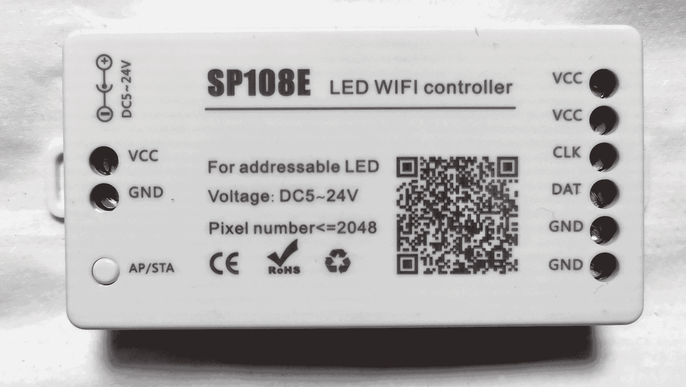
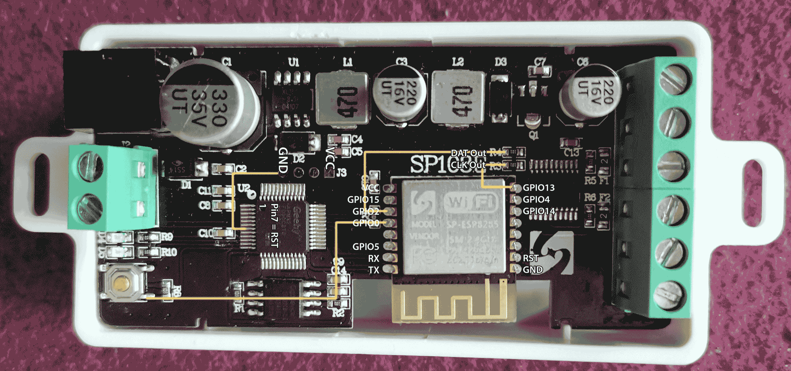

# sp108e-led-controller
The SP108e controller is designed to control adressable led strips with a DATA and with or without an CLK line. It operates between 5-24V DC input. Default app is LED Shop from 
from 'spledapps'. There are different versions of this controller. The newer version, I call it 'v2', has 2 VCC, 2 GND, 1 CLK and 1 DAT output on the right side and contains an ESP8285 with 2MB Flash inside.

After hardware modification you can use Tasmota, WLED or ESPHome on it. If you are okay with no CLK out, you can use SP501e instead, which does not require a hardware modification and has additional drivers for non-addressable RGBCCT strips soldered (see https://margau.net/posts/2020-11-21-2h-led-hack/).

## Hardware Modification for flashing other firmware
The device use a separate controller (STM32F0) to control CLK and Data lines of the led strips. To hold this controller in reset state, please connect Pin 7 (Reset) to GND. After that, the ESP8285 can be flashed by pull down GPIO0 to GND.

Connect GPIO2 to R4 for DAT out and GPIO13 for CLK out

## Flashing firmware
To flash firmware to the controller, you can use any ESP programmer module or other UART Serial adapter with 3,3V. Connect RX, TX, GND and VCC (3.3V!) between the programmer/power source and the ESP chip. To flash an ESP, you also have to connect GPIO0 to GND at boot time to enable the programming mode instead of starting the flashed firmware. See the corresponding pins at the image provided above.

Flashing the firmware can be done with `esptool.py --port COM6 write_flash 0x000000 firmware.bin`. 

## Differences between controllers
| Controller    | Flash | Data out | Clock out | Levelshifter | non-Adressable Driver out | needs Hardware mod | Button | LED | Case |
|---------------|-------|----------|-----------|--------------|---------------------------|--------------------|--------|-----|------|
| SP501E        | 1-2MB | yes      | no        | no           | 5ch (RGB+CCT)             | no                 | yes    | no  | yes  |
| SP108E        | 2MB   | yes      | yes       | yes          | no                        | yes                | no     | yes | yes  |
| WeMos D1 Mini | 4MB   | yes      | yes       | no           | no                        | no                 | yes    | yes | no   |
